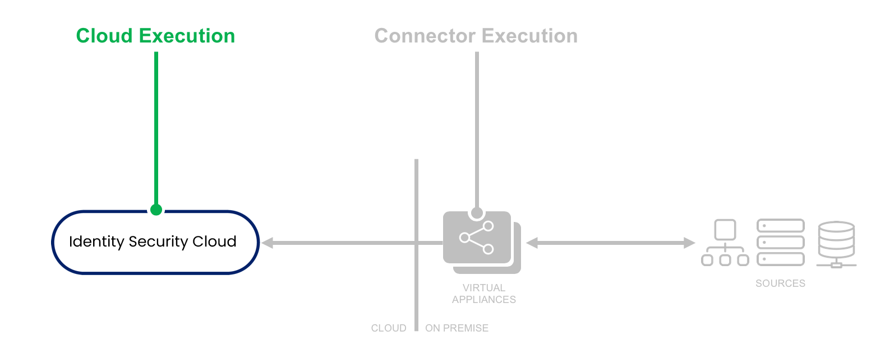

# BuildMap Rule

## Overview

This rule manipulates raw input data provided by the rows and columns in a file and builds a map from the incoming data. Use this rule to create a new value by combining two columns together. For example, if one column was `access` and another `permissions` you could combine these together to create an entitlement `admin-read`.

:::info This rule runs in the cloud, but it's really a connector rule because it executes against the DelimitedFileConnector. :::

## Execution

- **Cloud Execution** - This rule executes in the Identity Security Cloud cloud, and has read-only access to the records from the Delimited File being imported. However, it doesn't have access to on-premise sources or connectors.
- **Logging** - Logging statements are currently only visible to SailPoint personnel.



## Input

| Argument | Type | Purpose |
| --- | --- | --- |
| col | java.util.List | Ordered list of the column names from the file’s header records or specified columns list. |
| record | java.util.List | Ordered list of the values for the current record, parsed based on the specified delimiter. |
| application | System.Collections.Hashtable | Map of the application configuration. |
| schema | sailpoint.object.Schema | Reference to the schema object for the delimited file source being read. |

## Template

```xml
<?xml version='1.0' encoding='UTF-8'?>
<!DOCTYPE Rule PUBLIC "sailpoint.dtd" "sailpoint.dtd">
<Rule name="Example Rule" type="BuildMap">
  <Description>Describe your rule here.</Description>
  <Source><![CDATA[

  // Add your logic here.

  ]]></Source>
</Rule>
```

## Example

```java
<?xml version='1.0' encoding='UTF-8'?>
<!DOCTYPE Rule PUBLIC "sailpoint.dtd" "sailpoint.dtd">
<Rule name="Example Rule" type="BuildMap">
  <Description>This basic rule performs the combines 2 values into a single attribute.</Description>
  <Source><![CDATA[

     import sailpoint.connector.DelimitedFileConnector;

     Map map = DelimitedFileConnector.defaultBuildMap( col, record );
     String access = (String) map.get( "access" );
     String permission = (String) map.get( "permission" );

     if ( access != null && permission != null ) {
          map.remove("access");
          map.remove("permission");
          map.put("access", access + " - " + permission);
     }
     return map;

  ]]></Source>
</Rule>
```
